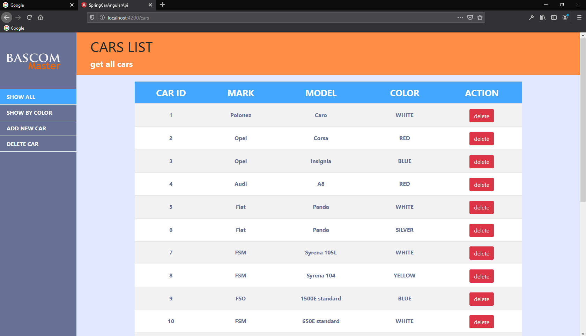
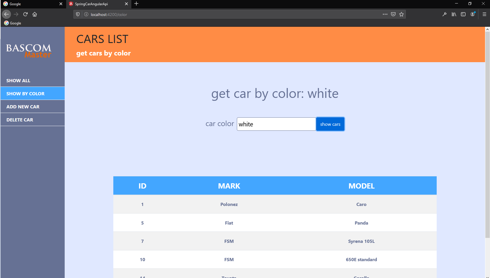
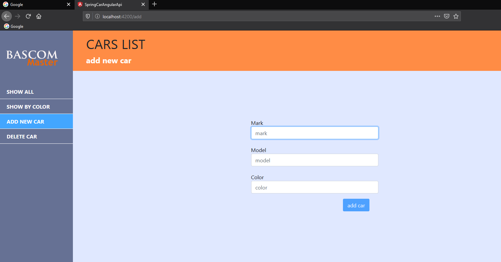
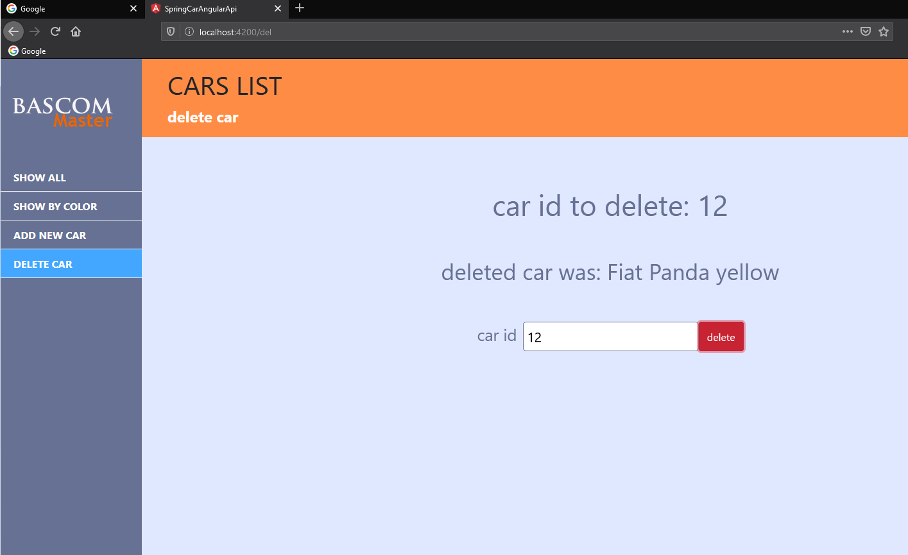

# SpringCarAngularApi

This project was generated with [Angular CLI](https://github.com/angular/angular-cli) version 7.3.1.


## Short informatins

This project was made only for education. It is very basic application which allows display cars list, add new car to list, delete car, get cars by id and color. Application needs to work really simple json rest api serve by json server or web application.

```json
{
  id: number,
  mark: string,
  model: string,
  color: string
}
```
For testing this application you can use Spring boot app from https://github.com/bascommaster/car-list-restapi.git repository.

## Screen shots


 Start view display all cars from list.


Get cars by color. 


Add new car to list form.


Delete car using id.

## Development server

Run `ng serve` for a dev server. Navigate to `http://localhost:4200/`. The app will automatically reload if you change any of the source files.


